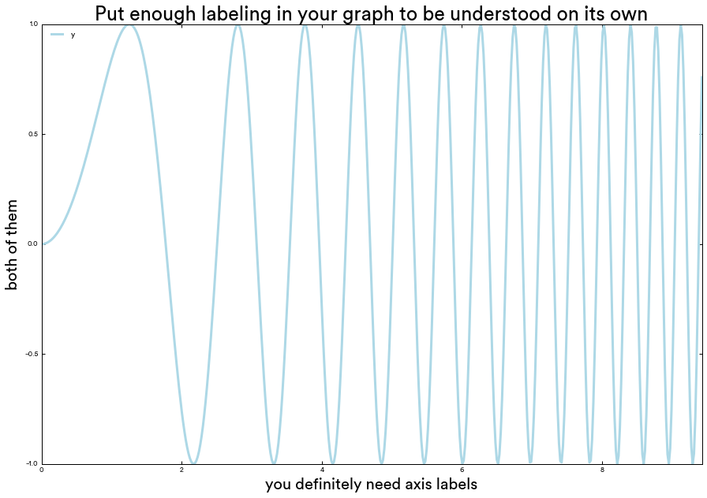

*NOTE: In the TL,DR, optimize for **clarity** and **comprehensiveness**. The goal is to convey the post with the least amount of friction, especially since ipython/beakers require much more scrolling than blog posts. Make the reader get a correct understanding of the post's takeaway, and the points supporting that takeaway without having to strain through paragraphs and tons of prose. Bullet points are great here, but are up to you. Try to avoid academic paper style abstracts.*

 - Having a specific title will help avoid having someone browse posts and only finding vague, similar sounding titles
 - Having an itemized, short, and clear tl,dr will help readers understand your content
 - Setting the reader's context with a motivation section makes someone understand how to judge your choices
 - Visualizations that can stand alone, via legends, labels, and captions are more understandable and powerful


### Motivation

*NOTE: optimize in this section for **context setting**, as specifically as you can. For instance, this post is generally a set of standards for work in the repo. The specific motivation is to have least friction to current workflow while being able to painlessly aggregate it later.*

The knowledge repo was created to consolidate research work that is currently scattered in emails, blogposts, and presentations, so that people didn't redo their work.

### This Section Says Exactly This Takeaway


```python
import pandas as pd
import numpy as np
import matplotlib
from matplotlib import pyplot as plt


%matplotlib inline

x = np.linspace(0, 3*np.pi, 500)
plot_df = pd.DataFrame()
plot_df["x"] = x
plot_df["y"] = np.sin(x**2)


plot_df.plot('x', 'y', 
             color='lightblue',
             figsize=(15,10))
plt.title("Put enough labeling in your graph to be understood on its own", size=25)
plt.xlabel('you definitely need axis labels', size=20)
plt.ylabel('both of them', size=20)
```


    <matplotlib.text.Text at 0x1119e1cd0>





*NOTE: in graphs, optimize for being able to **stand alone**. When aggregating and putting things in presentations, you won't have to recreate and add code to each plot to make it understandable without the entire post around it. Will it be understandable without several paragraphs?*

### Putting Big Bold Headers with Clear Takeaways Will Help Us Aggregate Later

### Appendix

Put all the stuff here that is not necessary for supporting the points above. Good place for documentation without distraction.
